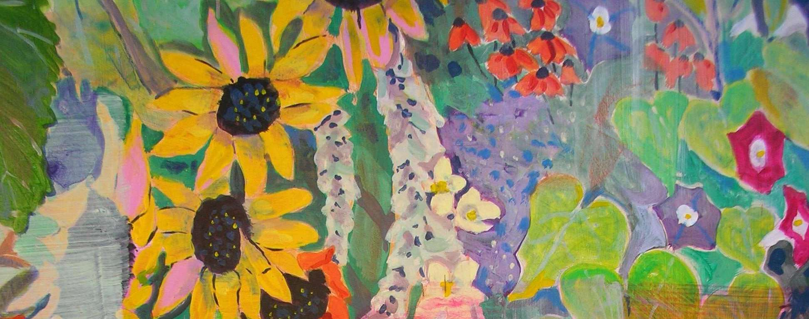

# About
{:.no_toc}

## Table of contents
{: .no_toc .text-delta }

1. TOC
{:toc}

---


  



## About

Nancy Travers, a renowned Oregon painter, has left an indelible mark on the artistic landscape with her captivating works. With a passion for ceramics and watercolors, Nancy dedicated an impressive 25 years of her career teaching these art forms at Clackamas Community College. Her expertise lies in both thrown work and hand building techniques, showcasing her versatility and deep understanding of her craft.

Drawing inspiration from her extensive travels across Europe and Mexico, Nancy's artwork reflects the vibrant cultures and breathtaking landscapes she has encountered. Her explorations in these regions, often supplemented by sabbatical leaves dedicated to immersive study in Mexico, have greatly influenced her artistic style and vision.

Nancy's paintings encompass a wide range of subjects, with a focus on people, landscapes, and the beauty of nature. Working primarily with watercolor and acrylic, she skillfully captures the essence and spirit of her subjects, creating captivating portraits that evoke a sense of emotion and connection.

Throughout her artistic journey, Nancy Travers continues to inspire and engage viewers with her masterful use of color, composition, and technique. Her dedication to her craft and her ability to convey the intricacies of life through her art make her a revered figure in the Oregon art community and beyond.




  

    
  



